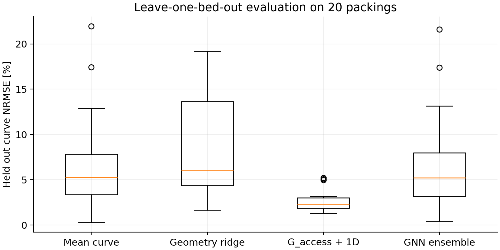
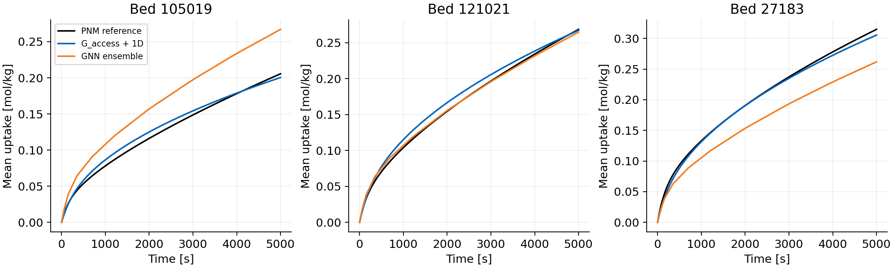
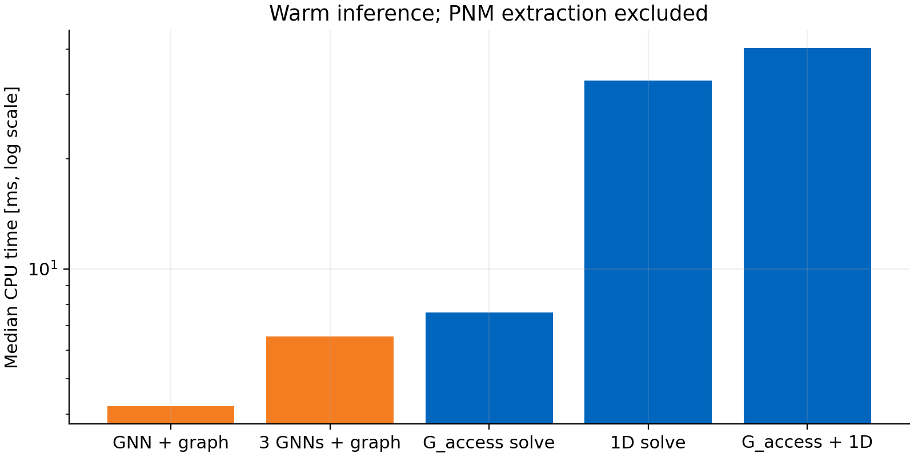

# Direct particle GNN versus the G_access uptake workflow

## Main result

The GNN ensemble has mean held-out curve NRMSE **6.82%**, compared with **2.61%** for G_access plus the 1D model and **6.82%** for the training mean curve.

This evaluates one small, fixed GNN on only 20 independent beds. It does not establish the best achievable performance of GNNs or other machine-learning approaches. The G_access closure and 5dp depth were previously selected using this ensemble, so their reported result is internal validation of an existing choice.

## Accuracy on exactly the same held-out beds

| Method | Mean curve NRMSE | Worst curve NRMSE | Final uptake MAPE | Final uptake R2 |
|---|---:|---:|---:|---:|
| Training mean curve | 6.82% | 21.94% | 9.44% | -0.108 |
| Geometry ridge | 8.84% | 19.17% | 12.53% | -0.878 |
| G_access power law + 1D | 2.61% | 5.21% | 3.58% | 0.849 |
| Direct GNN, three-model ensemble | 6.82% | 21.61% | 9.42% | -0.105 |

Curve NRMSE uses trapezoidal time weighting and divides each bed’s error by its PNM uptake at 5000 s. The three random initializations are not 60 independent test beds. Each of the 20 test beds is excluded entirely from that fold’s training.





The GNN has lower curve error than the physics closure on **5/20** beds. Mean paired difference is **+4.21 percentage points** (GNN minus physics). A descriptive paired bed bootstrap gives [+1.80, +6.85] percentage points; it does not account for dependence from overlapping cross-validation training sets.

## GNN learning and curve representation

The mean training-curve NRMSE over 60 fits is **6.48%**. Individual initialization test errors are:
- gnn_init_11: 6.84% mean curve NRMSE.
- gnn_init_29: 6.83% mean curve NRMSE.
- gnn_init_47: 6.77% mean curve NRMSE.

Interpolating the true curve at the 13 prescribed knots gives mean NRMSE **0.214%**. This uses the test labels and is only a curve-representation diagnostic, never a predictive baseline.

The decoder guarantees zero initial uptake, nondecreasing loading and an equilibrium upper bound at the campaign conditions. It does not enforce the adsorption mass-balance equations. Piecewise-linear interpolation is restricted to 0–5000 s; no extrapolation or new operating conditions are validated.

## Inference timing

Median across the 20 per-bed timing medians, with five warm repeats on the same CPU and one computational thread. Inputs and weights are already resident in memory. Graph construction is included explicitly; model loading and disk I/O are excluded.

| Stage | Median time |
|---|---:|
| Particle graph construction and tensor assembly | 3.031 ms |
| One GNN, graph already available | 1.174 ms |
| Three GNNs, graph already available | 3.512 ms |
| Particle positions to curve, one GNN | 4.211 ms |
| Particle positions to curve, three GNNs | 6.542 ms |
| Steady G_access solve, pore network already available | 7.601 ms |
| Algebraic conductance to diffusivity mapping | 0.001 ms |
| 100-cell 1D uptake solve | 32.815 ms |
| Cached pore network to uptake curve | 40.182 ms |

The median per-bed timing ratio is **6.2x** for the cached-network physics workflow relative to the GNN ensemble with graph construction. This is **not an end-to-end raw-particle speedup**: PNM extraction, Sobol volume allocation and geometry-to-1D porosity/height preparation are excluded from the physics timing.



The 60 GNN training loops took **458.4 s** in total. This excludes graph preparation and evaluation. Training-label PNM simulations and fitted-diffusivity generation are also excluded and must be considered when assessing total development cost.

## Interpretation

Speed should be compared at acceptable predictive accuracy. This GNN stays near the mean-curve baseline even on its training beds, indicating limited learning in this prescribed representation/optimization setup; it is not evidence that neural networks cannot represent inlet effects. More epochs, richer geometry, normalization, architecture changes or additional independent beds may change the outcome, but selecting those using these test scores would require a new validation design.

The physics and GNN workflows both predict this particular PNM model, including its approximate inlet representation. Neither is independently validated against experimental uptake or resolved transport. The GNN uses no pore topology or inlet labels, so its task is harder than learning from the already-extracted network.

## Reproduction and exact inputs

Run from `code_work` with NumPy, SciPy, pandas, Matplotlib, scikit-learn, threadpoolctl and CPU-capable PyTorch installed:

```bash
python compare_co2_gnn_uptake.py
python summarize_co2_gnn_comparison.py
python -m unittest discover -s tests -p "test_gnn_uptake.py" -v
```

To demonstrate direct prediction on the first held-out bed without building a pore network:

```bash
python predict_co2_gnn_uptake.py --particle-dump co2_13x_seed_18427/particles_final.dump --output co2_gnn_curve_comparison/example_direct_prediction.csv
```

The protocol was written before inspecting test predictions. Hyperparameters and 200 epochs are fixed, with no selection of the best initialization. Geometry ridge uses fold-fitted standardization and fixed regularization. Training targets, including the mean curve initializing the GNN decoder, exclude the test bed.

Particle positions are read from the existing NPZ files for convenience, but the GNN graph builder reads only the particle-position array. It constructs its own distance-neighbour graph. The physically fixed bead diameter and tube geometry supply length scales; G_access, pore labels, fitted diffusivity, seed ID and adsorption descriptors are not GNN features.

All per-bed curves (`held_out_curves.csv.gz`), training seeds, timings and file hashes are included. The particle-input audit verifies exact agreement with the original DEM dumps for all 20 beds. `example_held_out_model.pt` is the first fold’s first initialization, not a production model trained on all 20 beds. Representative plots show the lowest, middle and highest final-uptake beds and do not determine reported aggregate scores.

Structural tests verify particle-permutation invariance, rotation about the tube axis, independence between graphs in a batch, interpolation and decoder bounds.

Implementation references: [PyTorch CPU threading and tensor operations](https://docs.pytorch.org/docs/stable/torch.html) and [scikit-learn guidance on data leakage](https://scikit-learn.org/stable/common_pitfalls.html#data-leakage).
