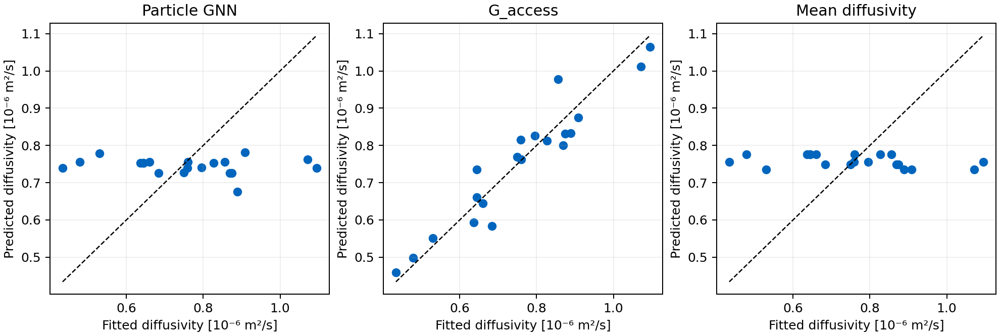

# Direct GNN prediction of effective diffusivity

All predictions below are for held out beds. No uptake curves were predicted.

| Model | Relative error (MAPE) | R² | Log RMSE |
|---|---:|---:|---:|
| G_access | 5.77% | 0.903 | 0.070 |
| geometric_mean | 20.45% | -0.082 | 0.244 |
| gnn | 20.71% | -0.072 | 0.246 |
| mean_diffusivity | 20.73% | -0.076 | 0.246 |

The GNN remains essentially at the mean baseline: direct scalar prediction did not provide useful generalization in this experiment. G_access is substantially more accurate. The GNN is also slower than the cached-network conductance calculation under the measured conditions; pore extraction costs could change an end-to-end comparison.

The target is effective diffusivity fitted from the existing PNM simulations. The GNN receives only particle geometry. It uses 32 latent features per particle, three residual message layers and regional mean/max pooling, followed by a scalar log diffusivity prediction. Training targets are standardized using training beds only. Three initializations are averaged in log space.

Five outer folds each hold out four beds. A separate inner 12/4 split selects weight decay and epoch, then refits on all 16 outer training beds. G_access power law and both mean baselines use the identical training beds. Detailed split membership and training histories are saved. See PROTOCOL.md for the fixed settings.

Median warm CPU times: graph construction 5.57 ms; three GNN inference passes 15.50 ms; combined GNN 21.17 ms; cached pore network G_access calculation plus diffusivity mapping 7.03 ms. Five repeats per bed, one CPU thread. Disk loading and pore network extraction are excluded. There is no 1D transient solve in this comparison.

This is exploratory internal validation on 20 previously studied beds. It does not establish performance for new packing regimes or independently measured diffusivities. Many particles in a graph do not increase the number of independent labeled beds.

Reproduce from code_work: `python compare_co2_gnn_diffusivity.py` then `python summarize_co2_gnn_diffusivity.py`.
