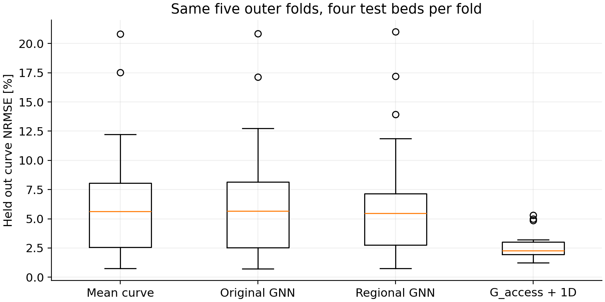
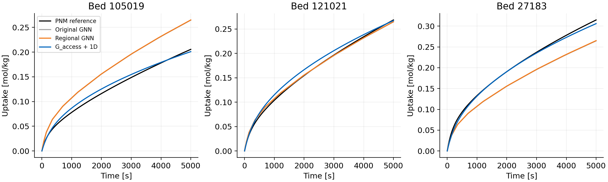
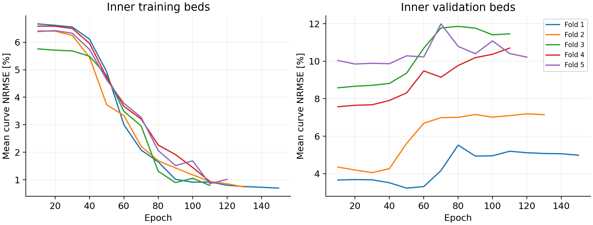

# Regional residual GNN comparison

## Result

The proposed model fits three training beds to **0.98%** curve NRMSE in **50 epochs**. This is a training-only diagnostic, not a generalization score.

On the same five outer validation folds, the proposed GNN has mean curve NRMSE **6.62%**, versus **6.78%** for the original GNN and **2.62%** for G_access plus 1D.

| Model | Mean curve NRMSE | Worst curve NRMSE | Final uptake MAPE | Final uptake R2 |
|---|---:|---:|---:|---:|
| Mean curve | 6.74% | 20.81% | 9.38% | -0.071 |
| Original GNN | 6.78% | 20.85% | 9.33% | -0.079 |
| Regional GNN | 6.62% | 21.00% | 9.21% | -0.027 |
| G_access + 1D | 2.62% | 5.30% | 3.65% | 0.841 |





The regional GNN improves on the original on 12/20 beds, and on G_access plus 1D on 6/20 beds. No model or initialization is selected using these outer scores.

The improvement over the original GNN is small, and the model remains close to the mean-curve baseline. Inner training errors fall below 1% while validation errors generally rise with longer training. This indicates overfitting in this experiment: greater fitting capacity has not delivered useful generalization. These results do not justify replacing the G_access closure with this GNN.

## Architecture and selection

The model has **19,821 trainable parameters**, 32 particle features per layer, three residual message-passing layers with LayerNorm, and separate mean/max pooling over bottom 0–2dp, 2–5dp and the whole bed. These form a 192-component bed representation, followed by a 32-unit hidden readout.

Distance and signed axial displacement enter fixed sparse geometric message bases, each with a learned feature projection at every layer. This is not a pore-network graph and uses no inlet labels, G_access or fitted diffusivity as GNN features. The constrained 13-knot decoder is unchanged: zero initial uptake, monotone increments and an equilibrium upper bound.

AdamW uses learning rate .001 and gradient clipping 5. Each outer fold has 16 training beds and four untouched test beds. Within the 16, a deterministic 12/4 training/validation split selects weight decay (1e-5 or 1e-4) and epoch, up to 1500 epochs, evaluated every 10 epochs with patience 100. The chosen settings are then refitted on all 16 beds with initializations 11, 29 and 47. Their predictions are averaged.

| Outer fold | Selected weight decay | Refit epochs | Inner validation NRMSE |
|---|---:|---:|---:|
| 1 | 1e-05 | 50 | 3.23% |
| 2 | 1e-05 | 30 | 4.06% |
| 3 | 0.0001 | 10 | 8.58% |
| 4 | 0.0001 | 10 | 7.57% |
| 5 | 0.0001 | 20 | 9.85% |

All candidate scores, training/validation/test seed lists and learning curves are stored. A single inner holdout is used, not exhaustive inner cross-validation; selection remains noisy with only 16 development beds per fold.



## Timing

Warm single-CPU-thread timing, median across 20 beds: graph preparation **5.80 ms**, three-model ensemble inference **16.29 ms**, combined **22.03 ms**. Each measurement uses five repeats after warmup and excludes loading files or weights.

Do not treat timings from different benchmark runs as an exact matched speedup. The earlier G_access plus 1D timing also excluded pore-network extraction. The larger GNN adds computation relative to the original architecture.

## Limits and interpretation

All methods here are refitted on the SAME outer training beds. These five-fold numbers should not be compared as identical experiments to the earlier leave-one-bed-out results, which trained on 19 beds. Curves use trapezoidal time-weighted error normalized by each test bed’s final PNM uptake.

The three-bed diagnostic confirms fitting capacity, not generalization. This is exploratory development on the same 20-bed ensemble already used to develop the physics closure and the initial GNN. Inner validation prevents direct use of the current outer test labels for settings, but does not turn the campaign into a new external test set. No claim that one architecture is generally superior is warranted.

Both models target the existing PNM simulations rather than experimental truth. Predictions at new bead sizes, sorbents, temperatures or inlet definitions are unvalidated. Curve constraints do not enforce local mass conservation.

## Reproduce

From `code_work`:

```bash
python compare_co2_gnn_v2.py --diagnostic-only
python compare_co2_gnn_v2.py
python summarize_co2_gnn_v2.py
python -m unittest discover -s tests -p "test_gnn_v2.py" -v
```

The diagnostic and main comparison use separate output files in `co2_gnn_v2`; previous GNN and presentation artifacts remain unchanged.
