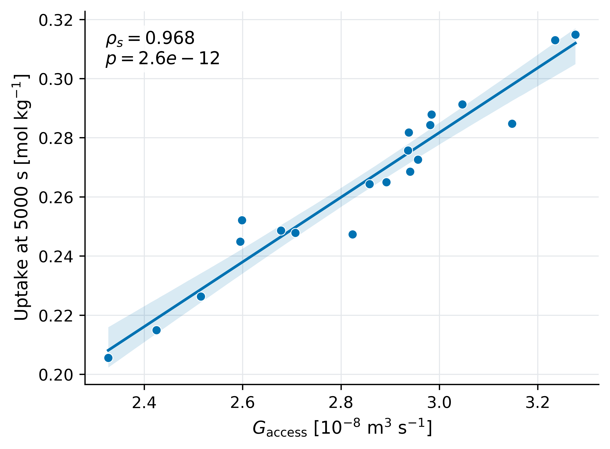
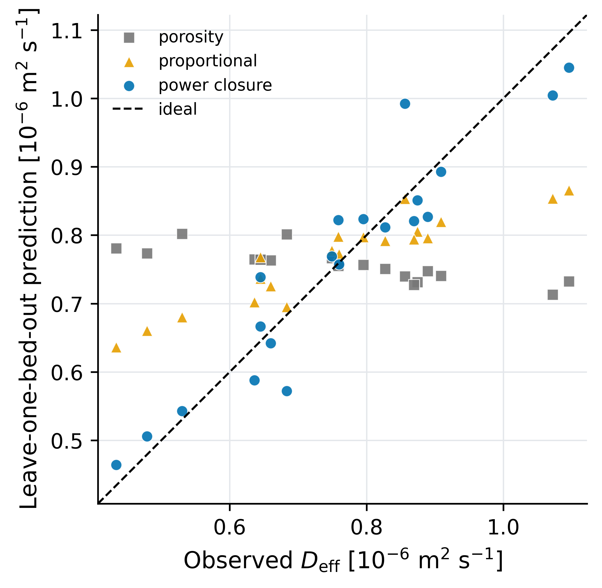

# Standalone publication figures

Regenerate from `code_work` with `python3 generate_co2_publication_figures.py`.
Each figure is an independent canvas without panel lettering. PDF/SVG are vector
formats; PNG is exported at 600 dpi. Blue, orange and green use the Okabe–Ito palette.
Shaded bands show pointwise bootstrap uncertainty of a fitted relationship, not
individual-bed prediction intervals. The original composite files remain only
because the current paper source references them. Both Beamer decks use the standalone PDFs.

- [porosity variability](fig_porosity_variability.pdf) · [SVG](fig_porosity_variability.svg) · [PNG](fig_porosity_variability.png)
- [uptake curves](fig_uptake_curves.pdf) · [SVG](fig_uptake_curves.svg) · [PNG](fig_uptake_curves.png)
- [porosity uptake](fig_porosity_uptake.pdf) · [SVG](fig_porosity_uptake.svg) · [PNG](fig_porosity_uptake.png)
- [accessibility uptake](fig_accessibility_uptake.pdf) · [SVG](fig_accessibility_uptake.svg) · [PNG](fig_accessibility_uptake.png)
- [accessibility utilization](fig_accessibility_utilization.pdf) · [SVG](fig_accessibility_utilization.svg) · [PNG](fig_accessibility_utilization.png)
- [homogeneous uptake](fig_homogeneous_uptake.pdf) · [SVG](fig_homogeneous_uptake.svg) · [PNG](fig_homogeneous_uptake.png)
- [homogeneous residuals](fig_homogeneous_residuals.pdf) · [SVG](fig_homogeneous_residuals.svg) · [PNG](fig_homogeneous_residuals.png)
- [closure power law](fig_closure_power_law.pdf) · [SVG](fig_closure_power_law.svg) · [PNG](fig_closure_power_law.png)
- [closure held out](fig_closure_held_out.pdf) · [SVG](fig_closure_held_out.svg) · [PNG](fig_closure_held_out.png)
- [depth correlations](fig_depth_correlations.pdf) · [SVG](fig_depth_correlations.svg) · [PNG](fig_depth_correlations.png)
- [depth prediction](fig_depth_prediction.pdf) · [SVG](fig_depth_prediction.svg) · [PNG](fig_depth_prediction.png)

